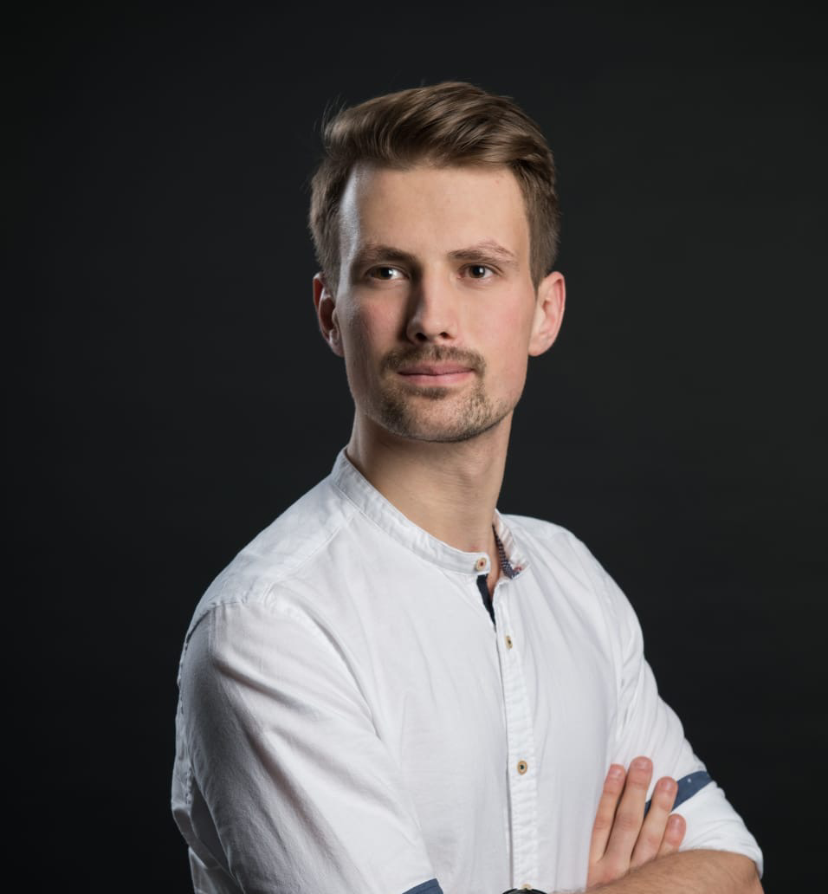

# Christopher Marx

> Online Resume: <https://github.com/ChrisMarxDev/ChrisMarxDev/blob/main/RESUME.md>

**Senior Software Engineer**  
Hamburg, Germany

## Summary

Product-driven full‑stack engineer currently focused on Flutter and cross‑platform apps. I deliver value quickly and prioritize pragmatic engineering and high‑quality user outcomes instead of fussing over perfect architecture.
Architecture serves the product, not the other way around.

### Contact Information

- Email: <dev@christopher-marx.de>
- Website: [christopher-marx.de](https://christopher-marx.de)
- GitHub: [ChrisMarxDev](https://github.com/ChrisMarxDev)
- LinkedIn: [christopher-marx](https://www.linkedin.com/in/christopher-marx-42bbb2179/)

# Education

### Master of Science in Business Informatics

University of Hamburg | 2016 – 2019 | Grade: 1.8

- Focus on the distributed systems working group (Verteilte Systeme, VSYS) with distributed client‑server systems using microservices, mobile applications, and blockchain systems.
- Secondary focus on artificial intelligence (AI) and natural language processing (NLP).
- Master's thesis: Use of decentralized oracles for inter‑blockchain communication in multi‑ledger systems.

### Bachelor of Science in Business Informatics

University of Hamburg | 2013 – 2016 | Grade: 2.1

Bachelor's thesis: The use of cloud computing for enterprise information systems, exemplified by retail, industry, and real estate

### Abitur

Vincent-Lübeck-Gymnasium, Stade | 2004 – 2013 | Grade: 1.9

# Work Experience

### Freelance Software Engineer
**Self employed** | Sep 2020 – Present

- Focus on developing cross‑platform mobile applications with Flutter and Dart.
- Backend development with Go, Kotlin Spring, TypeScript Cloud Functions, and Dart backends.
- Scrum Master and agile project management.
- UX, concept, and product advisory.

  **Clients:**

  - **Norma Lebensmittelfilialbetrieb Stiftung & Co. KG**: Lead Flutter Developer for the NORMA Plus app. Leading the rebuild of the app in Flutter from scratch.
  - **BMW**: Prototyping with Flutter for web and mobile; digital twin app for vehicles.
  - **Flip GmbH**: Mentor for the Flutter team.
  - **Rewe GmbH**: Senior Flutter Developer for the Cookie, Grill, and Summer Planner apps.
  - **App Innovators Solutions GmbH**: Flutter mentoring and interim senior developer.
  - **Xayn AG (now: noxtua AG)**: Senior Flutter engineer.
  - **Fatchd GmbH**: Senior Flutter and backend engineer.
  - **Eurotime AG**: Lead Flutter developer for the Eurotime app and internal tooling.
  - **Healy World GmbH**: Lead Flutter developer and Scrum Master. Leading the development of a Bluetooth health accessory companion app.
  - Miscellaneous smaller app and web clients.
  
 

### IT Consultant

**SVA System Vertrieb Alexander GmbH, Hamburg** | Sep 2019 – Nov 2020

- Sep 2019 – Mar 2020: Junior IT Consultant
- Focus on distributed systems with blockchain and mobile
- Consultation, concept design, project coordination, and development
- Software development: backend, web, and mobile frontend
- Clients: Wuppertaler Stadtwerke, City of Goslar, BWI, and Bundeswehr
- Development of PoCs, e.g., a blockchain‑ and Flutter‑based immunity passport presented to the German Ministry of Health
  
 

### Software Developer

**PPI AG, Hamburg** | Dec 2018 – Jun 2019

- Student job in cooperation with the master's thesis
- Project MAP: blockchain‑based platform for multi‑party insurance contracts
- Development of blockchain, frontend, and backend
- Implementation of integration, unit, and UI tests
  
 

### Software Developer Android

**APPsfactory GmbH, Hamburg** | Apr 2017 – Nov 2018

- Development of Android applications such as NDR Elbphilharmonie Orchester, Tagesschau, Deutschlandradio, and ABOUT BERLIN
- Agile project management
- Introduction of Flutter & Dart

 

## Community & Activities

- **Co-leading the Flutter DACH Community in Germany** - [Flutter DACH Meetup](https://www.meetup.com/de-DE/flutter-dach/)
- **Hosting the Flutter DACH Podcast** - [Spotify](https://open.spotify.com/show/2NBzKyS8LTiGgajzkXkJoa)
- **Technical Writing** - [Blog Articles](https://christopher-marx.de/blog/go_router_navigation_observer/)
- **Side Projects** - [Cookd App](https://cookd.app/)
- **Volunteer work** @ Sport gegen Rassismus e.V.

## Skills (Buzzwords)

- **AI Tools**: Versed in using Cursor, Claude Code, Codex, Gemini CLI, dartantic AI, Firebase Genkit, OpenAI API, and Gemini API
- **Mobile**: Flutter and Dart, Android, Kotlin and Java, unit testing, integration testing
- **Web**: HTML, CSS, TypeScript, JavaScript, Angular, React
- **Backend**: Java (Spring), Go, Python, Node.js, TypeScript, Dart (Frog, Serverpod)
- **Blockchain**: Ethereum, Tendermint, Hyperledger
- **DevOps**: Git Flow, CI/CD (Fastlane, GitLab, Bitrise), QA, Cloud (Azure, AWS, Firebase)
- **Design**: Basic design principles, UX, mockups, Figma, Sketch
- **Management**: Agile project management, Scrum, DevOps culture
- **Project Management**: Jira, Confluence, Trello

## Certifications

- **PSM 1**: Professional Scrum Master 1
- **PRINCE 2**: Foundation Certified Project Manager
- **PSPO 1**: Professional Scrum Product Owner
- **DevOps**: DevOps Foundation Certification

## Languages

- **German**: Fluent
- **English**: Fluent
