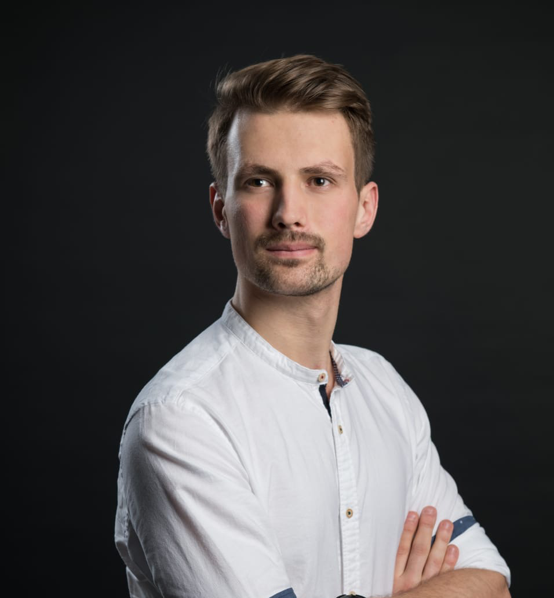

# Christopher Marx

**Freelance Senior Software Engineer**  
Hamburg, Germany

## Summary

Product driven senior mobile engineer focused on Flutter and cross platform apps; I ship value fast.
I prioritize pragmatic engineering and high quality user outcomes over architectural perfection; architecture serves the product, not the other way around.
I iterate quickly, tighten feedback loops, and keep code maintainable so teams can deliver reliably.

## Contact Information

- Email: dev@christopher-marx.de
- Website: [christopher-marx.de](https://christopher-marx.de)
- GitHub: [ChrisMarxDev](https://github.com/ChrisMarxDev)
- LinkedIn: [christopher-marx](https://www.linkedin.com/in/christopher-marx-42bbb2179/)

## Education

### Master of Science Business Informatics
University Hamburg | 2016 - 2019 | Grade: 1.8

- Focus on the distributed systems working group (Verteilte Systeme VSYS) with distributed client server systems using microservices, mobile applications & blockchain systems
- Secondary focus on artificial intelligence & NLP
- Master thesis: Use of decentralized oracles for inter blockchain communication in multi ledger systems

### Bachelor of Science Business Informatics

University Hamburg | 2013 - 2016 | Grade: 2.1

Bachelor thesis: The use of cloud computing for enterprise information systems exemplified by retail, industry and real estate

### Abitur

**Vincent-Lübeck-Gymnasium, Stade** | 2004 - 2013

## Work Experience

### Freelance Software Engineer (Mobile Apps)

#### Sep 2020 - Present

- Focus on development of cross platform mobile applications with Flutter & Dart
- Backend development with Node, Kotlin Spring and Dart Backends
- Scrum master & agile project management
- UX, concept & product development

     **Clients:**

    - **Norma Lebensmittelfilialbetrieb Stiftung & Co. KG**: Lead Flutter Developer for the NORMA Plus app. Rebuilding the app in Flutter from scratch
    - **BMW**: Prototyping work with Flutter web & mobile app. Digital twin app for vehicles
    - **Flip GmbH**: Mentor for the Flutter Team
    - **Rewe GmbH**: Sr. Flutter Developer for the Cookie, Grill and Summer Planner apps
    - **App Innovators Solutions GmbH**: Flutter mentoring & interim senior developer
    - **Xayn AG (Now: noxtua AG)**: Sr. Flutter engineer
    - **Fatchd GmbH**: Sr. Flutter & backend engineer
    - **Eurotime AG**: Lead Flutter Dev for the Eurotime App and internal tooling
    - **Healy World GmbH**: Lead Flutter developer & Scrum master. Leading development of a bluetooth health accessory companion app
    - Miscellaneous smaller app & web clients

### IT Consultant

**SVA System Vertrieb Alexander GmbH, Hamburg** | Sep 2019 - Nov 2020

- Sep 2019 - Mar 2020: Junior IT consultant
- Focus on distributed systems with blockchain & mobile
- Consultation, conception, project coordination & development
- Software development backend, web & mobile frontend
- Customers: Wuppertaler Stadtwerke, City Goslar, BWI & Bundeswehr
- Development of PoCs. E.g. a blockchain & Flutter based immunity passport presented to the german department of health

### Software Developer

**PPI AG, Hamburg** | Dec 2018 - Jun 2019

- Student job in cooperation with the master thesis
- Project MAP: blockchain based platform for multi party insurance contracts
- Development of blockchain-, frontend- and backend
- Implementation of integration-, unit- & UI tests

### Software Developer Android

**APPsfactory GmbH, Hamburg** | Apr 2017 - Nov 2018

- Development of Android applications such as: NDR Elbphilharmonie Orchester, Tagesschau, Deutschlandradio, ABOUT BERLIN
- Agile project management
- Introduction of Flutter & Dart

## Community & Activities

**Co-Leading the Flutter DACH Community in Germany** - [Flutter DACH Meetup](https://www.meetup.com/de-DE/flutter-dach/)

**Hosting the Flutter DACH Podcast** - [Spotify](https://open.spotify.com/show/2NBzKyS8LTiGgajzkXkJoa)

**Technical Writing** - [Blog Articles](https://christopher-marx.de/blog/go_router_navigation_observer/)

**Side Projects** - [Cookd App](https://cookd.app/)

**Voluntary work** @ Sport gegen Rassismus e.V.

## Skills

**AI Tools**: Versed in using Cursor, Claude Code, Codex, Gemini CLI, dartantic ai, Firebase Genkit, OpenAI API, Gemini API

**Mobile**: Flutter & Dart, Android, Kotlin & Java, unit testing, integration testing

**Web**: HTML, CSS, TypeScript, JavaScript, Angular, React

**Backend**: Java (Spring), Go, Python, Node.js, TypeScript, Dart (Frog, Serverpod)

**Blockchain**: Ethereum, Tendermint, Hyperledger

**DevOps**: Git Flow, CI/CD (Fastlane, GitLab, Bitrise), QA, Cloud (Azure, AWS, Firebase)

**Design**: Basic design & design principles, UX, mockups, Figma, Sketch

**Management**: Agile project management, Scrum, DevOps culture

**Project Management**: Jira, Confluence, Trello

## Certifications

**PSM 1**: Professional Scrum Master 1

**PRINCE 2**: Foundation Certified Project Manager

**PSPO 1**: Professional Scrum Product Owner

**DevOps**: DevOps Foundation Certification

## Languages
**German**: Fluent

**English**: Fluent

